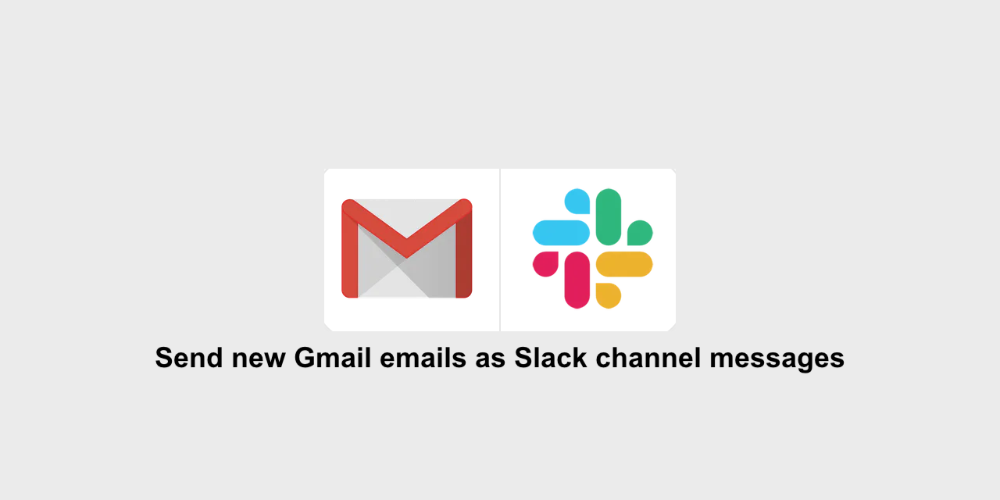
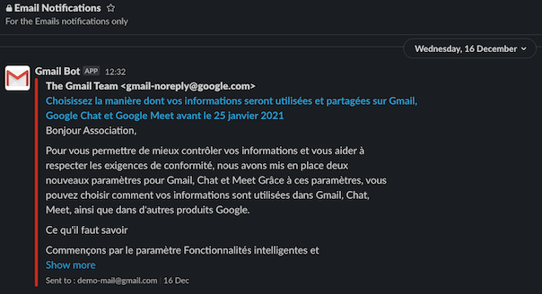

# Send emails to Slack

  

If your team works on a Slack workspace, and the team has to maintain one, or a bunch of different email ids and wish to be notified of every email instantly on Slack; there is a hack for you and an alternative to [Send emails to Slack](https://slack.com/intl/en-fr/help/articles/206819278-Send-emails-to-Slack) which work only with ~~Free~~, Standard, Plus, and Enterprise Grid plans.

  

# How does it work?

After setting up your Slackbot chat as a forward emailing address of your email account `(Steps explained below)` this bot watches for messages in the Slackbot chat and whenever a message arrives with an attached email, it forwards it to a channel as a message.

# How to make it work?

1. Setup a `forwarding email`. If you send any email to this address, it will appear as a file in your `Direct messages` channel with Slackbot.
2. Add this address as a forwarding address of your email account. (For Gmail find forwarding options from Gmail settings).
3. Use Slack API to get notified about this.
4. Use Slack API to post the email on a channel you want to.
5. Add your Slack app config in the server.

## Detailed steps

1. From Slack, navigate to:
    1. `Preferences` _(top right corner icon)_
    2. `Messages & media`
    3. `Bring emails into Slack`. It will generate an email address for you. Any email sent to this address will appear in your `Direct messages` with Slackbot.

2. Go to the email provider (like Gmail) from where you want to forward the messages to Slack. In the forwarding options, put the email generated by Slack to forward email to.
    - In case of Gmail, you will have to provide a verification token which is sent to your Slackbot.

3. Go to [api.slack.com/apps](https://api.slack.com/apps)
    - Create a new Slack App named: `Gmail Bot` or something else `Outlook Bot`
    - Navigate to the app dashboard and find `Event Subscriptions` in the sidebar
        - In `Request URL`, add your web server script url `https://domain.tld/email-to-slack.php`
        - Subscribe to `message.im` in `Subscribe to events on behalf of users`

4. In the sidebar, go to `OAuth & Permissions`
    - In `Scopes`, part `Bot Token Scopes` add these OAuth Scope:
        - `files:read`
        - `im:history`
        - `incoming-webhook`
    - Install your app to your Workspace

5. In your server, add environment variables config, which is detailed in next part (example):
`APP_ID=A12ED963ZQS INCOMING_WEBHOOK_URL=https://hooks.slack.com/services/T12DRSFGE/C02EV6KLCCY/neWIoLN0nXQ0obVgHlxXmYgc TEAM_ID=T12DRSFGE USlackbot_CHANNEL=D050CBER9 VERIFICATION_TOKEN=ZZHla9Kj8l4L28PceIoDB3IX`

Refer to [SLACK API FAQ](https://api.slack.com/faq) for more help.

A bit more?
- In `Basic Information`, you can change `Display Information` to get beautiful notifications

  

# Description of environment variables used by the repository

- Set these environment variables in your server:

| Config Variable        | Description                                                      |
|------------------------|------------------------------------------------------------------|
| `APP_ID`               | You get this when you create the app                             |
| `INCOMING_WEBHOOK_URL` | You get this when you install the app on one channel             |
| `TEAM_ID`              | ID of your slack workspace. [See this](https://stackoverflow.com/questions/40940327/what-is-the-simplest-way-to-find-a-slack-team-id-and-a-channel-id) |
| `USLACKBOT_CHANNEL`    | The ID of the direct messaging channel between you and @slackbot |
| `VERIFICATION_TOKEN`   | You get this when you create the app                             |

Note that the Slack IDs (for a channel, users, files) are alphanumeric uppercase string of 9 characters.

Notes:
  - Slack creates a beautiful file for an email. But I could not find way to change file permissions which is shared privately with just the user. Hence, I have to customize and post the email. If there is a way to change file permissions from private to be shared in a team, that would be easy and the best way.

## Authors

- **Mehdi Chaouch** - *Maintainer* - 

## License

This project is licensed under the MIT License - see the [LICENSE](./LICENSE) details.

## Credits

### Inspired by

This was designed with the inspiration from this fine folks:
- a Python version of [email-to-slack](https://github.com/kossiitkgp/email-to-slack/) from KOSS-Kharagpur Open Source Society
